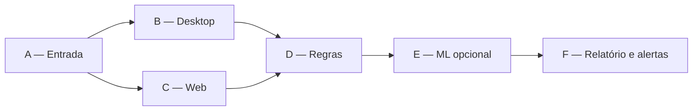

# Hyperautomation

[](https://github.com/NunesGustavo0/Hyperautomation/actions/workflows/ci-cd.yml)

Pipeline híbrido para conferência de lotes, aplicação das regras RN01–RN12,
classificação assistida por Machine Learning, geração de relatório executivo e
execução local de seis etapas e orquestração legada de três bots pelo BotCity
Maestro.

O Fedora é o ambiente padrão de desenvolvimento e execução do Runner.

## Objetivo

O projeto automatiza o processamento de uma planilha de inspeções e preserva a
rastreabilidade do lote desde a entrada até o relatório final. O fluxo combina:

- validação estrutural da planilha;
- regras determinísticas RN01–RN12;
- classificação por Machine Learning em casos elegíveis;
- fallback quando a API ML está indisponível ou abaixo do limiar de confiança;
- tratamento de falhas de dados com retentativas e dead letter;
- alertas pelo Telegram, com e-mail como canal secundário;
- geração de relatório Excel e evidências de execução;
- execução demonstrável A → B/C → D → E → F;
- orquestração A → B → C já validada no BotCity Maestro.

## Arquitetura



Os seis bots são etapas lógicas independentes no pipeline E2E local. O deploy
Maestro disponível no repositório mantém três pacotes, agrupando D/E na
conferência e F no relatório. A migração real para seis automações no Smart
Office permanece pendente de acesso à plataforma.

As tarefas sucessoras mantêm:

- `predecessor`;
- `predecessor_task_id`;
- `resultado_predecessor`;
- `execution_id`;
- `correlation_id`.

## Bots e responsabilidades

| Etapa | Identificador | Responsabilidade |
| --- | --- | --- |
| Bot A | `bot-a-entrada` | Criar IDs e validar a entrada. |
| Bot B | `bot-b-coleta-desktop` | Coletar estoque no simulador visual. |
| Bot C | `bot-c-coleta-web` | Coletar pedidos no portal local. |
| Bot D | `bot-d-regras` | Consolidar fontes e aplicar regras determinísticas. |
| Bot E | `bot-e-ml` | Enriquecer registros pela API ML ou fallback. |
| Bot F | `bot-f-relatorio-alertas` | Gerar relatório e emitir alertas. |

Os labels Maestro v1 continuam definidos em `src/orchestrator.py`. Alterá-los
na plataforma sem atualizar o código impede a criação das tarefas sucessoras.

## Tecnologias

- Python 3.12;
- Pytest;
- OpenPyXL e Pandas;
- FastAPI e Uvicorn;
- scikit-learn;
- Playwright;
- Docker e Docker Compose;
- BotCity Maestro SDK e BotCity Runner;
- Telegram Bot API e SMTP.

## Estrutura principal

| Caminho | Responsabilidade |
| --- | --- |
| `src/bots/bot_entrada.py` | Regra de execução do Bot A. |
| `src/bots/bot_conferencia.py` | Regra de execução do Bot B. |
| `src/bots/bot_relatorio.py` | Regra de execução do Bot C. |
| `src/bots/*_maestro.py` | Pontos de entrada integrados ao Maestro. |
| `src/orchestrator.py` | Criação das tarefas sucessoras e labels dos bots. |
| `src/maestro_client.py` | Criação do cliente do Maestro para Runner e execução local. |
| `src/maestro_artifacts.py` | Localização, download e publicação de artefatos. |
| `src/transferencia_resultado_bot_b.py` | Serialização do resultado intermediário do Bot B. |
| `src/validacao_lotes.py` | Regras determinísticas RN01–RN12. |
| `src/ml_client.py` | Cliente resiliente da API ML. |
| `src/ml_decisions.py` | Auditoria das decisões de ML e fallback. |
| `src/dead_letter.py` | Retentativas e armazenamento de itens não processados. |
| `src/sistema_alertas.py` | Telegram principal e e-mail como fallback. |
| `api_ml/main.py` | API FastAPI com `/health` e `/predict`. |
| `gerar_relatorio.py` | Geração do Excel e do resumo executivo. |
| `executar_pipeline_bots.py` | Demonstração local da cadeia A → B → C. |
| `executar_pipeline_capstone.py` | Demonstração E2E local dos seis bots. |
| `src/politicas_resiliencia.py` | Exceções, limites, backoff e sanitização comuns. |
| `documentacao/PDD_CAPSTONE.md` | Processo implementado, regras e exceções. |
| `documentacao/RUNBOOK_CAPSTONE.md` | Diagnóstico e recuperação operacional. |
| `deploy/maestro/` | Entrypoints utilizados nos pacotes do Maestro. |
| `scripts/build_bots_maestro.sh` | Geração dos três arquivos ZIP. |
| `tests/` | Testes unitários, integração, crise e E2E. |
| `.github/workflows/ci-cd.yml` | Pipeline de qualidade e resiliência. |

## Pré-requisitos

- Fedora ou outra distribuição Linux compatível;
- Python 3.12 ou superior;
- Git;
- Docker com Docker Compose;
- acesso ao BotCity Orquestrador para execução no Maestro;
- BotCity Studio SDK e Runner configurados no Fedora.

No Fedora, instale os pacotes de sistema antes do ambiente Python:

```bash
sudo dnf install -y git python3 python3-pip python3-tkinter docker docker-compose-plugin xorg-x11-server-Xvfb
sudo systemctl enable --now docker
```

O usuário precisa de permissão para acessar o Docker. Após adicioná-lo ao grupo
`docker`, encerre e abra uma nova sessão para que a alteração tenha efeito.

## Instalação local

```bash
git clone https://github.com/NunesGustavo0/Hyperautomation.git
cd Hyperautomation

python -m venv .venv
source .venv/bin/activate

python -m pip install --upgrade pip
python -m pip install -r requirements.txt
python -m pip install -r requirements-dev.txt
python -m playwright install chromium
```

## Configuração do ambiente

Crie o arquivo local a partir do modelo:

```bash
cp .env.example .env
chmod 600 .env
```

O `.env` contém configurações locais e não deve ser versionado nem incluído nos
pacotes do Maestro.

Principais variáveis:

| Variável | Finalidade |
| --- | --- |
| `CAMINHO_ENTRADA` | Caminho absoluto da planilha usada pelo Bot A como fallback local. |
| `PIPELINE_HIBRIDO_ENABLED` | Habilita o pipeline híbrido de regras e ML. |
| `ML_ENABLED` | Habilita as consultas ao serviço de ML. |
| `ML_API_URL` | Endereço da API ML. |
| `ML_MIN_CONFIDENCE` | Limiar mínimo para aceitar a predição. |
| `ML_TIMEOUT_SECONDS` | Timeout da chamada à API ML. |
| `BASE_REFERENCIA_MAX_TENTATIVAS` | Limite de consultas à base crítica. |
| `BASE_REFERENCIA_BACKOFF_SECONDS` | Intervalo base entre consultas. |
| `TELEGRAM_BOT_TOKEN` | Token do bot do Telegram. |
| `TELEGRAM_CHAT_ID` | Destino das mensagens do Telegram. |
| `EMAIL_ENABLED` | Habilita o canal secundário por e-mail. |
| `EMAIL_SMTP_HOST` | Servidor SMTP. |
| `EMAIL_SMTP_PORT` | Porta SMTP. |
| `EMAIL_SMTP_USER` | Usuário SMTP. |
| `EMAIL_SMTP_PASSWORD` | Senha ou senha de aplicativo SMTP. |
| `EMAIL_FROM` | Remetente do alerta. |
| `EMAIL_TO` | Destinatário do alerta. |

A relação completa, incluindo Maestro, simuladores e feature flags, está em
`.env.example`. Valores vazios significam integração desabilitada ou ainda não
configurada; nunca coloque credenciais reais no arquivo versionado.

Exemplo para o Fedora:

```env
CAMINHO_ENTRADA=/home/usuario/Hyperautomation/data/input/inspecao_lotes_10dias.xlsx
PIPELINE_HIBRIDO_ENABLED=true
ML_ENABLED=true
ML_API_URL=http://localhost:8000
ML_MIN_CONFIDENCE=0.70
```

Na execução pelo Maestro, `caminho_entrada` recebido pela tarefa tem prioridade.
Quando ele não é informado, o Bot A tenta `CAMINHO_ENTRADA` carregado do `.env`
local do Runner. Para senhas e tokens em produção, prefira o armazenamento de
Credenciais do Maestro.

## Machine Learning

O ML auxilia nos casos elegíveis, mas não substitui as regras RN01–RN12. Uma
predição só é aceita quando o serviço responde corretamente e a confiança
atinge o limiar configurado.

### Modelo adotado

O modelo atual utiliza `LogisticRegression` em vez de `RandomForest`.

| Aspecto | RandomForest | LogisticRegression |
| --- | --- | --- |
| Complexidade | Maior | Menor |
| Tamanho serializado | Maior | Menor |
| Probabilidade | Média de várias árvores | Probabilidade diretamente interpretável |
| Dataset pequeno e controlado | Pode memorizar padrões | Adequado como baseline simples |
| Inicialização da API | Mais pesada | Mais leve |

A troca foi feita para manter um classificador menor, determinístico e simples
de explicar durante a auditoria. Uma nova troca de modelo deve ser baseada em
métricas reproduzíveis, e não apenas em preferência de algoritmo.

### Treinar o modelo

```bash
python train_model.py
```

### Executar a API localmente

```bash
python -m uvicorn api_ml.main:app \
  --host 0.0.0.0 \
  --port 8000
```

Valide:

```bash
curl http://localhost:8000/health
```

Resposta esperada:

```json
{
  "status": "healthy",
  "modelo_carregado": true
}
```

## Execução com Docker Compose

```bash
docker compose config
docker compose up -d --build api_ml
docker compose ps api_ml
```

Verifique o endpoint:

```bash
curl http://localhost:8000/health
```

Para encerrar:

```bash
docker compose down
```

## Demonstração E2E dos seis bots

O Fedora é o ambiente de referência para a demonstração local. Após instalar
as dependências do projeto, execute na raiz do repositório:

```bash
python executar_pipeline_capstone.py --alertas console
```

O comando inicia o simulador desktop em modo headless, o portal web e a API ML,
executa os seis bots, grava os artefatos em `data/output/capstone_e2e` e encerra
todos os processos auxiliares, inclusive quando ocorre uma falha. Nenhuma
credencial real ou acesso ao Smart Office é utilizado.

## Demonstração local dos três bots

Com alertas exibidos no terminal:

```bash
python executar_pipeline_bots.py \
  data/input/inspecao_lotes_10dias.xlsx \
  --alertas console
```

Com Telegram e e-mail configurados:

```bash
python executar_pipeline_bots.py \
  data/input/inspecao_lotes_10dias.xlsx \
  --alertas reais
```

Sem alertas:

```bash
python executar_pipeline_bots.py \
  data/input/inspecao_lotes_10dias.xlsx \
  --alertas nenhum
```

Saídas principais:

```text
reports/relatorio_conferencia_lotes.xlsx
logs/pipeline_bots.jsonl
```

## Alertas e fallback

O Telegram é o canal principal. Para eventos `ERRO` e `CRÍTICO`, uma falha do
Telegram aciona o e-mail. O resultado registra:

- canal tentado;
- sucesso ou falha;
- motivo da falha;
- se o fallback foi acionado;
- canal que realizou a entrega.

Se os dois canais falharem, o pipeline continua e registra um log local em nível
crítico. Falhas de comunicação não devem interromper o lote.

## Dead letter

Erros de dados são tentados novamente conforme a configuração. Quando todas as
tentativas falham, o item é enviado para dead letter com sua causa e contexto.
Os demais registros continuam sendo processados.

O arquivo padrão é `data/output/dead_letter.jsonl`. Cada linha é um evento
append-only com `dead_letter_id`, IDs de rastreabilidade, motivo, tentativas,
horário e payload sanitizado. Consulte o procedimento de reprocessamento em
`documentacao/RUNBOOK_CAPSTONE.md`.

## Logs, relatórios e evidências

- logs estruturados: `logs/` e `data/output/capstone_e2e/pipeline_capstone.jsonl`;
- relatórios: `reports/` e `data/output/capstone_e2e/relatorio_final.xlsx`;
- screenshots e HTML de falha: `screenshots/`;
- dead letter: `data/output/dead_letter.jsonl`;
- exemplo sanitizado: `documentacao/exemplos/relatorio_exemplo.md`.

Use `execution_id` para identificar uma execução e `correlation_id` para unir
logs, alertas, tarefas e artefatos da mesma cadeia.

## Deploy no BotCity Maestro

### Gerar os pacotes

```bash
bash scripts/build_bots_maestro.sh
```

Pacotes esperados:

```text
dist/maestro/carlos_souza-entrada-v1.zip
dist/maestro/carlos_souza-conferencia-v1.zip
dist/maestro/carlos_souza-relatorio-v1.zip
```

Valide:

```bash
for pacote in dist/maestro/*.zip; do
  unzip -t "$pacote"
done
```

Os pacotes não devem conter `.env`, `__pycache__` ou arquivos `.pyc`.

### Publicar pelo Easy Deploy

Para cada bot:

1. Acesse **Easy Deploy** no Orquestrador.
2. Crie ou selecione a automação correspondente.
3. Envie o arquivo ZIP.
4. Selecione a tecnologia Python.
5. Informe uma versão e marque-a como release.
6. Vincule o Runner do Fedora.

Crie primeiro as automações dos Bots B e C. Assim, quando o Bot A terminar, a
automação sucessora já estará disponível.

### Parâmetro inicial

O Bot A aceita o parâmetro de tarefa:

```text
caminho_entrada
```

Ele deve apontar para um arquivo acessível pelo usuário que executa o Runner. O
parâmetro pode ficar opcional quando `CAMINHO_ENTRADA` estiver configurado no
ambiente local.

## Testes

Suíte completa:

```bash
python -m pytest -q
```

Por camada:

```bash
python -m pytest tests/unit -q
python -m pytest tests/integration -q
python -m pytest tests/integration/test_simulacao_crise.py -q
python -m pytest tests/integration/test_simulacao_crise_capstone.py -q
python -m pytest tests/e2e -q
```

Testes do Maestro:

```bash
python -m pytest \
  tests/unit/test_bot_entrada_maestro.py \
  tests/unit/test_bot_conferencia_maestro.py \
  tests/unit/test_bot_relatorio_maestro.py \
  tests/integration/test_orquestracao_maestro.py \
  tests/integration/test_rastreabilidade_cadeia_bots.py \
  -q
```

Cobertura:

```bash
python -m pytest \
  --cov \
  --cov-report=term-missing \
  --cov-report=html
```

## Integração contínua

O workflow `.github/workflows/ci-cd.yml` executa:

1. testes unitários;
2. testes de integração;
3. simulação automatizada de crise;
4. testes E2E;
5. build e healthcheck da API ML em container;
6. geração e validação dos três pacotes do Maestro;
7. publicação de logs, relatórios e evidências como artefatos.

O job final falha quando qualquer camada obrigatória não termina com sucesso.

## Segurança

- Não versione `.env`.
- Não inclua tokens e senhas nos ZIPs.
- Não registre segredos nos logs.
- Use senha de aplicativo para SMTP quando exigido pelo provedor.
- Prefira Credenciais do Maestro para ambientes compartilhados.
- Revogue imediatamente qualquer token que tenha sido exposto.

## Resultado validado

O deploy real no BotCity Maestro foi validado com sucesso em 31 de agosto de
2026. A cadeia A → B → C processou a planilha de inspeções e publicou o
relatório Excel final como arquivo de resultado do Bot C.

Essa validação não comprova o Smart Office nem o desmembramento em seis
automações reais. Integração, filas, credenciais, coexistência e rollback no
Smart Office continuam explicitamente adiados até existir acesso e evidência.
