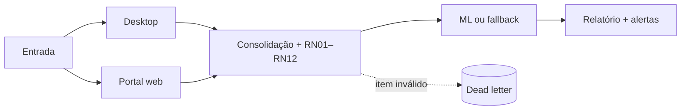
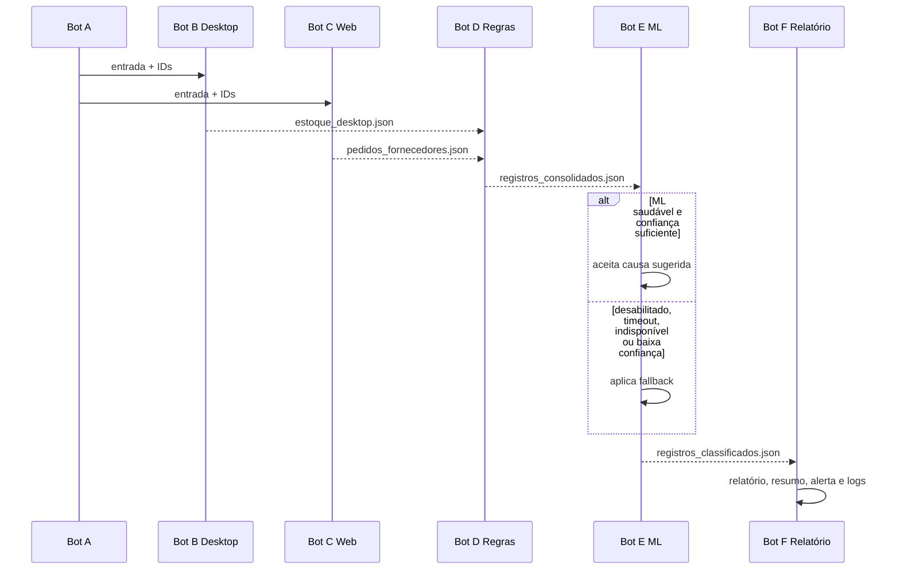

# PDD — Hyperautomation Capstone

## 1. Finalidade

Automatizar a coleta e conferência de estoque e pedidos, preservar a decisão
determinística, enriquecer divergências com ML opcional e publicar relatório,
alertas e evidências auditáveis.

## 2. Processo atual (AS-IS)

O operador consulta aplicações separadas, compara estoque e pedidos, aplica
regras de conferência, investiga causas e prepara o relatório. Indisponibilidades
e registros inválidos exigem intervenção manual e podem interromper o trabalho.

## 3. Processo implementado (TO-BE)

1. Bot A valida a entrada e cria `execution_id` e `correlation_id`.
2. Bot B coleta a massa do sistema desktop simulado.
3. Bot C coleta pedidos do portal web simulado.
4. Bot D consolida as fontes e aplica as RN01–RN12.
5. Bot E consulta a API ML somente para enriquecimento e aplica fallback.
6. Bot F gera o relatório, o resumo, os logs e o alerta.

## 4. Contratos e rastreabilidade

Os contratos Pydantic estão em `src/contratos_capstone.py`. Todo artefato deve
preservar `schema_version`, `execution_id`, `correlation_id`, `bot_id`, `task_id`,
estado, predecessor e horário com fuso. Os estados são `CONCLUIDO`,
`CONCLUIDO_DEGRADADO`, `FALHOU`, `CANCELADO` e `TIMEOUT`.

## 5. Regras e papel do ML

As RN01–RN12 são a autoridade sobre validade, divergência, ambiguidade e erro de
entrada. O ML sugere apenas a causa provável, com confiança e versão auditadas.
Ele não substitui as regras porque sua saída é probabilística, pode ficar
indisponível e não deve alterar uma decisão crítica determinística. Se a feature
flag estiver desligada ou ocorrer timeout, indisponibilidade, resposta inválida
ou baixa confiança, o lote continua com fallback explícito.

## 6. Exceções

| Exceção | Tratamento |
| --- | --- |
| Desktop indisponível | Retry limitado, backoff, screenshot e estado degradado/falha. |
| Portal indisponível | Retry limitado, screenshot/HTML e continuidade conforme fonte disponível. |
| Dependência em timeout | Encerramento controlado; nunca espera infinita. |
| Item inválido | `ErroDeItem`, tentativas limitadas, dead letter e próximo item. |
| Infraestrutura | `ErroDeInfraestrutura`, retry limitado e registro degradado. |
| ML indisponível | Fallback `servico_indisponivel`; decisão determinística preservada. |
| Telegram indisponível | E-mail para eventos elegíveis. |
| Todos os alertas falham | Relatório permanece válido e a falha é registrada. |

## 7. Entradas e saídas

Entradas são a planilha de inspeções e as massas determinísticas dos simuladores.
As saídas incluem JSON de desktop/web, consolidação, classificação, Excel,
resumo, logs, screenshots e `dead_letter.jsonl`. Um exemplo sem dados sensíveis
está em `documentacao/exemplos/relatorio_exemplo.md`.

## 8. Operação e manutenção

Instalação e comandos ficam no `README.md`; diagnóstico no
`documentacao/RUNBOOK_CAPSTONE.md`; arquitetura e decisões adiadas em
`documentacao/arquitetura_capstone.md`. Mudanças de schema exigem atualização
dos produtores, consumidores, testes contratuais e versão do contrato.

## 9. Limitações

O E2E local usa simuladores reais locais, não sistemas de produção. O Maestro A
→ B → C foi validado, mas Smart Office, coexistência real, filas, cutover e
rollback permanecem pendentes. Fakes de Smart Office não constituem evidência
de validação da plataforma.
