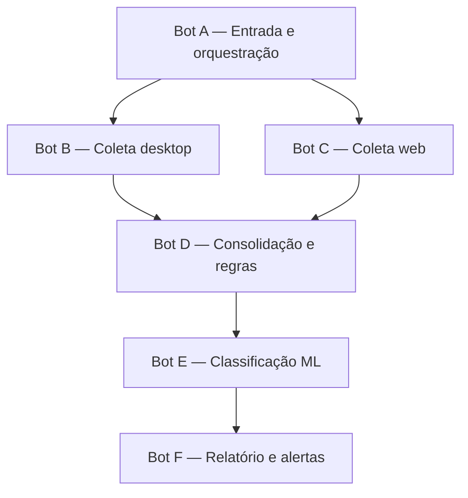
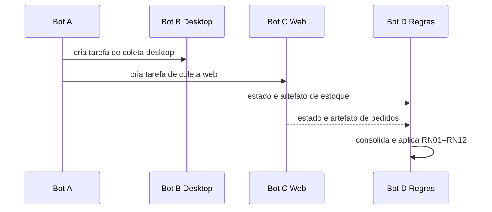
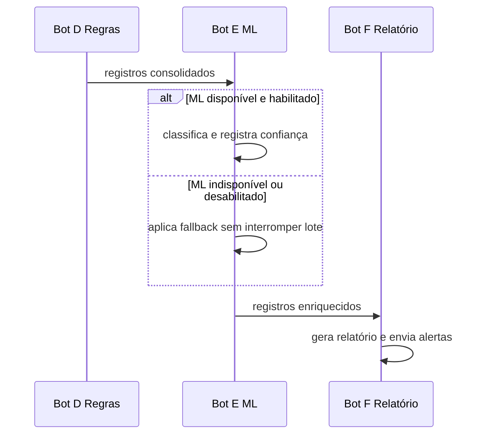

# Arquitetura do Projeto Final Capstone

## 1. Objetivo

Este documento define a arquitetura-alvo do projeto Hyperautomation para o projeto final Capstone. O fluxo atual de três bots será evoluído para seis bots independentes, mantendo as regras determinísticas, o ML opcional, a rastreabilidade, a tolerância a falhas e os canais de alerta já implementados.

Esta etapa é exclusivamente arquitetural. As alterações no código serão realizadas nas issues seguintes.

## 2. Situação atual e evolução planejada

| Componente atual | Papel atual | Destino no Capstone |
|---|---|---|
| Bot A — Entrada | Valida a entrada e inicia a cadeia | Será ampliado para Bot A — Entrada e Orquestração |
| Bot B — Conferência | Lê, valida e classifica os registros | Sua lógica determinística será reaproveitada no Bot D — Consolidação e Regras |
| Bot C — Relatório | Gera relatório e dispara alertas | Será ampliado para Bot F — Relatório e Alertas |
| Cliente ML | Enriquece a decisão durante o fluxo | Será encapsulado no Bot E — Classificação ML |
| Sistema de alertas | Telegram com fallback por email | Será utilizado pelo Bot F |
| Dead letter | Armazena itens irrecuperáveis | Será compartilhada pelos bots que processam itens |

O reaproveitamento reduz o risco de regressão. Os bots atuais continuam funcionando enquanto os novos componentes são desenvolvidos em branches isoladas.

## 3. Arquitetura-alvo



O Bot A executa um fan-out, criando B e C como tarefas independentes. O Bot D representa o fan-in: ele avalia o estado das duas coletas antes de consolidar os dados.

## 4. Identificação oficial dos bots

| Bot | Activity label planejada | Origem |
|---|---|---|
| A | `carlos_souza-entrada-v2` | Evolução de `carlos_souza-entrada-v1` |
| B | `carlos_souza-coleta-desktop-v1` | Novo bot |
| C | `carlos_souza-coleta-web-v1` | Novo bot |
| D | `carlos_souza-conferencia-v2` | Evolução de `carlos_souza-conferencia-v1` |
| E | `carlos_souza-classificacao-ml-v1` | Novo bot |
| F | `carlos_souza-relatorio-v2` | Evolução de `carlos_souza-relatorio-v1` |

A versão é alterada quando existe mudança incompatível no contrato de entrada ou de saída. Uma correção interna que preserve o contrato não exige nova activity label.

## 5. Responsabilidade de cada bot

### 5.1 Bot A — Entrada e Orquestração

Responsabilidades:

- receber os parâmetros iniciais da execução;
- validar apenas a presença e o formato básico da entrada;
- criar ou preservar `execution_id` e `correlation_id`;
- disparar os Bots B e C;
- definir prioridade e deadline das coletas;
- registrar as tarefas sucessoras criadas;
- impedir criação duplicada das mesmas tarefas.

O Bot A não coleta dados, não aplica RN01–RN12, não chama o ML e não gera o relatório.

### 5.2 Bot B — Coleta Desktop

Responsabilidades:

- abrir ou localizar o sistema desktop simulado;
- executar cliques, digitação e leitura visual;
- coletar os registros de estoque sem utilizar API ou acesso direto ao banco;
- aplicar timeout, retry e backoff na automação visual;
- produzir screenshot e log em caso de falha;
- publicar o artefato `estoque_desktop.json`.

O Bot B não aplica as regras de negócio e não consulta o portal web.

### 5.3 Bot C — Coleta Web

Responsabilidades:

- acessar o portal de fornecedores por navegador;
- consultar pedidos utilizando automação web;
- tratar paginação, espera, timeout e indisponibilidade;
- capturar screenshot ou página em caso de falha;
- publicar o artefato `pedidos_fornecedor.json`.

O Bot C não lê diretamente o banco do portal e não consolida os dados.

### 5.4 Bot D — Consolidação e Regras

Responsabilidades:

- aguardar B e C até o deadline configurado;
- avaliar sucesso, falha, cancelamento ou timeout de cada coleta;
- carregar os artefatos disponíveis;
- consolidar estoque e pedidos;
- aplicar exclusivamente as regras RN01–RN12;
- definir o status oficial de cada registro;
- encaminhar itens irrecuperáveis para dead letter;
- publicar o artefato `registros_consolidados.json`.

O Bot D é a autoridade da decisão determinística. O ML não pode sobrescrever um status crítico definido neste bot.

### 5.5 Bot E — Classificação ML

Responsabilidades:

- consumir os registros consolidados;
- respeitar `ML_ENABLED` e `ML_MIN_CONFIDENCE`;
- consultar a API ML quando estiver habilitada;
- registrar classe, confiança, latência e versão do modelo;
- aplicar fallback em indisponibilidade, timeout, resposta inválida ou baixa confiança;
- publicar o artefato `registros_classificados.json`.

O Bot E apenas enriquece o resultado. A falha do ML nunca interrompe o lote nem altera o status determinístico.

### 5.6 Bot F — Relatório e Alertas

Responsabilidades:

- gerar o relatório executivo em Excel;
- gerar PDF ou Markdown quando habilitado;
- resumir divergências, causas, status e origem das decisões;
- indicar saúde das fontes desktop, web e ML;
- enviar Telegram como canal principal;
- usar email como fallback para eventos ERRO e CRÍTICO;
- registrar canal utilizado e tentativas de entrega;
- publicar os relatórios como artefatos finais.

O Bot F não recalcula regras nem executa nova predição.

## 6. Envelope obrigatório de rastreabilidade

Toda tarefa e todo artefato deve transportar os campos abaixo:

| Campo | Tipo | Descrição |
|---|---|---|
| `schema_version` | string | Versão do contrato, inicialmente `1.0` |
| `execution_id` | string | Identifica uma execução completa do pipeline |
| `correlation_id` | string | Relaciona logs, alertas, artefatos e tarefas |
| `bot_id` | string | Identifica o bot produtor do evento |
| `task_id` | string | Identifica a tarefa atual no orquestrador |
| `predecessor` | string ou nulo | Activity label do predecessor |
| `predecessor_task_id` | string ou nulo | ID da tarefa predecessora |
| `resultado_predecessor` | string ou nulo | Resultado informado pelo predecessor |
| `registrado_em` | string ISO 8601 | Data e hora com fuso horário |

Exemplo:

```json
{
  "schema_version": "1.0",
  "execution_id": "exec-001",
  "correlation_id": "corr-001",
  "bot_id": "bot-b-coleta-desktop",
  "task_id": "task-b-100",
  "predecessor": "carlos_souza-entrada-v2",
  "predecessor_task_id": "task-a-099",
  "resultado_predecessor": "pronto_para_coleta",
  "registrado_em": "2026-09-01T10:00:00-04:00"
}
```

## 7. Contratos entre os bots

### 7.1 Bot A para Bots B e C

Entrada mínima das coletas:

```json
{
  "schema_version": "1.0",
  "execution_id": "exec-001",
  "correlation_id": "corr-001",
  "predecessor": "carlos_souza-entrada-v2",
  "predecessor_task_id": "task-a-099",
  "resultado_predecessor": "pronto_para_coleta",
  "deadline_seconds": 120
}
```

O Bot B também recebe a identificação da janela ou aplicação desktop. O Bot C também recebe a URL do portal. Valores sensíveis devem ser obtidos por variável de ambiente ou cofre da plataforma, nunca pelo payload.

### 7.2 Bots B e C para Bot D

O Bot D recebe referências dos dois artefatos:

```json
{
  "schema_version": "1.0",
  "execution_id": "exec-001",
  "correlation_id": "corr-001",
  "coleta_desktop": {
    "task_id": "task-b-100",
    "estado": "CONCLUIDO",
    "artifact_name": "estoque_desktop.json"
  },
  "coleta_web": {
    "task_id": "task-c-101",
    "estado": "CONCLUIDO",
    "artifact_name": "pedidos_fornecedor.json"
  }
}
```

### 7.3 Bot D para Bot E

O Bot D publica:

- registros normalizados;
- status determinístico;
- regras aplicadas;
- divergências identificadas;
- indicação de execução normal ou degradada;
- estado de cada fonte.

Artefato: `registros_consolidados.json`.

### 7.4 Bot E para Bot F

O Bot E acrescenta:

- `origem_decisao`;
- `causa_provavel`;
- `classe_ml`;
- `confianca_ml`;
- `versao_modelo`;
- `latencia_ms`;
- `motivo_fallback`.

Artefato: `registros_classificados.json`.

### 7.5 Saída do Bot F

Artefatos finais:

- `relatorio_conferencia_lotes.xlsx`;
- `relatorio_conferencia_lotes.pdf`, quando habilitado;
- `resumo_execucao.json`;
- logs correlacionados da execução;
- evidências de envio dos alertas.

## 8. Estados padronizados

| Estado | Significado | Pipeline pode continuar? |
|---|---|---|
| `CONCLUIDO` | Etapa terminou com todos os recursos esperados | Sim |
| `CONCLUIDO_DEGRADADO` | Etapa terminou usando fallback ou com fonte parcial | Sim |
| `FALHOU` | Erro impediu a etapa de produzir saída utilizável | Depende da etapa |
| `CANCELADO` | Tarefa foi cancelada pelo orquestrador ou operador | Depende da outra fonte |
| `TIMEOUT` | A etapa ultrapassou o deadline | Depende da outra fonte |

Quando somente uma das coletas B/C estiver disponível, o Bot D pode continuar em modo degradado. Quando nenhuma fonte produzir dados utilizáveis, o Bot D encerra com falha controlada e o Bot F deve ser acionado somente para comunicar a falha, quando a plataforma permitir.

## 9. Sequência principal

### 9.1 Entrada e coletas



### 9.2 ML, relatório e alertas



## 10. Tratamento arquitetural de falhas

| Falha | Responsável por detectar | Comportamento esperado |
|---|---|---|
| Aplicação desktop indisponível | Bot B | Retry/backoff, screenshot, estado de falha e possível execução degradada |
| Portal web indisponível | Bot C | Retry/backoff, evidência e possível execução degradada |
| Dependência acima do deadline | Bot D/orquestrador | Marcar timeout e decidir continuidade sem espera infinita |
| Item de dados inválido | Bot D | Tentar conforme política, enviar para dead letter e continuar lote |
| API ML fora do ar | Bot E | Aplicar fallback determinístico e continuar |
| Confiança abaixo do limiar | Bot E | Não aceitar classe ML; registrar baixa confiança |
| Telegram indisponível | Bot F | Acionar email para ERRO/CRÍTICO |
| Telegram e email indisponíveis | Bot F | Registrar log crítico sem lançar exceção no pipeline |
| Tarefa duplicada por coexistência | Orquestrador | Recusar pela chave idempotente e auditar a origem vencedora |

## 11. Independência da plataforma

As regras, contratos e casos de uso não devem importar diretamente o SDK do BotCity Maestro ou do Smart Office. Cada plataforma será representada por um adaptador com operações equivalentes:

- obter execução atual;
- criar tarefa sucessora;
- consultar tarefa predecessora;
- publicar e baixar artefato;
- finalizar tarefa;
- registrar prioridade;
- registrar alerta operacional.

Enquanto o Smart Office não estiver disponível, o adaptador BotCity Maestro permanece como implementação real e um adaptador falso será utilizado nos testes contratuais.

## 12. Regras que não podem ser violadas

1. O ML não substitui as regras determinísticas.
2. Nenhuma dependência pode gerar espera infinita.
3. Um item inválido não pode interromper todo o lote.
4. Falhas toleráveis devem produzir modo degradado explícito.
5. Toda tarefa deve preservar os IDs de rastreabilidade.
6. Nenhuma credencial pode ser registrada no repositório, log ou artefato.
7. A coexistência de orquestradores não pode gerar processamento duplicado.
8. Uma integração externa não pode lançar exceção não controlada até o pipeline.

## 13. Decisões adiadas

As decisões abaixo dependem de acesso oficial ao Smart Office:

- nomes e tipos exatos de filas da plataforma;
- formato real de publicação e download de artefatos;
- mecanismo nativo de prioridade;
- estados retornados pelo SDK;
- configuração de runner/agente;
- credenciais e variáveis disponíveis;
- execução real de coexistência, cutover e rollback.

Esses itens devem permanecer marcados como pendentes até existir evidência real. A ausência do Smart Office não impede a implementação dos contratos independentes da plataforma.

## 14. Critérios de conclusão desta arquitetura

- [x] Seis bots possuem responsabilidade única.
- [x] O fluxo A → B/C → D → E → F está definido.
- [x] Entradas, saídas e artefatos estão descritos.
- [x] Estados de sucesso, falha, cancelamento, timeout e degradação estão definidos.
- [x] Rastreabilidade obrigatória está definida.
- [x] O ML está formalizado como enriquecimento não crítico.
- [x] A estratégia não depende diretamente de um único orquestrador.
- [x] As decisões bloqueadas pelo Smart Office estão identificadas.

